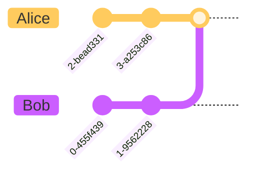

---
theme:
  override:
    default:
      colors:
        background: "1b1235"
    code:
      theme_name: Nord
    mermaid:
      background: "#1b1235"
      scale: 2

---

Kunekt's Private Collab on Kusama JAM
=====================================

### Let's explore the stack of **unstoppable, private, real-time JAM powered applications**

<!-- new_line -->
<!-- column_layout: [1, 1] -->
<!-- font_size: 2 -->

<!-- column: 0 -->
📜 The protocol  ~>  
⚙️ The engine    ~>  
🖼️ The framework ~>  

<!-- column: 1 -->
**Kunekt** (~parachains)   
**VOS** (~CoreVM)  
**Writ** (~FRAME/ink!) 
<!-- font_size: 1 -->
<!-- pause -->
**☝🏼 DevX first, so we start here*

<!-- end_slide -->

About Me
========

<!-- column_layout: [3, 1, 5] -->
<!-- column: 0 -->

**Daniel (@olanod)**


<!-- column: 2 -->

Passionate about:
<!-- font_size: 2 -->
- 🐦‍⬛ **Kusama**/freedom
- 🔓 **Open Source**
- 🔒 **Privacy** 
- 🌐 **Decentralization**
- 🦀 **Rust**

<!-- end_slide -->

About Virto
===========

<!-- column_layout: [3, 1, 7] -->
<!-- column: 0 -->


<!-- column: 2 -->
We on-board start-ups building real-world products to Web3 **like it's Web2**

<!-- font_size: 2 -->
## A **"Web3 CTO as a Service"**.

<!-- font_size: 1 -->
> Get a toolkit with *almost** everything you need to power your business

<!-- end_slide -->

Kusama JAM
==========

<!-- column_layout: [5, 1, 5] -->
<!-- column: 0 -->

Decentralized, Private, Kreative,

<!-- font_size: 2 -->
# **Fast**, Light and Independent

<!-- font_size: 1 -->
In **Ref#573** KSM holders voted for
- **1sec** block production
- 32 cores

<!-- column: 2 -->


<!-- pause -->
*... So many possibilities! 🤤*

<!-- end_slide -->

The protocol: **Kunekt**
=======================

## Private real-time collaboration on JAM

<!-- column_layout: [5, 1, 5] -->
<!-- column: 0 -->

Because organizations also need:
- **Communications**
- **Collaboration**
- **Encrypted data**
- and **The best UX**

```mermaid +render
block
columns 2
  core1["🧮 JAM Core"]
  core2["🧮 JAM Core"]
  space
  space
  user("👤📱📲👤\n(P2P sync of CRDTs)")
  para("🟩 Kreivo\n(Can still talk to paras)")

  user --> core1
  core2 --> para
  core1 <--> core2
```

<!-- column: 2 -->


<!-- end_slide -->

Kunekt Overview
===============

<!-- column_layout: [1, 1] -->
<!-- column: 0 -->
### Like Git
Eventual consistency with merkle-CRDTs


<!-- column: 1 -->
### Like Matrix
Encryption with megolm group ratchet


<!-- end_slide -->

The Engine: VOS
===============

<!-- font_size: 3 -->
# An actual Operating System
<!-- column_layout: [1, 1] -->

<!-- font_size: 1 -->
<!-- column: 0 -->
- ⚙️ Cooperative *async* multitasking
- 🖥️ AOT-compiled WASM-WASI tasks(apps)
- 📜 Shell Scripting

<!-- column: 1 -->

- 🤖 Abstractions(FS, IPC,)
- 🚀 Runs Everywhere
  - Linux
  - Web
  - Bare metal
  - **JAM**

<!-- end_slide -->

Progressive Decentralization
============================

<!-- column_layout: [1, 2, 1] -->
<!-- column: 1 -->
The *Let's be sneaky* strategy
<!-- reset_layout -->

<!-- column_layout: [1, 1] -->
<!-- column: 0 -->
### With Developers
Let's give them a tool they can use today on their current projects.
> ⚠️ Many(Most?) developers *hate* Blockchain

<!-- column: 1 -->
### With Organizations
Let's provide usefup APIs with well known technology, easy to integrate in existing infra.

> ⚠️ Why hire specialized talent(e.g. Solidity devs)

<!-- reset_layout -->
 
<!-- end_slide -->


Writ
====
Find the differences ...
<!-- column_layout: [1, 1] -->
<!-- column: 0 -->

```rust
#[writ::task]
pub mod flipper {
  #[writ(storage)]
  pub struct Flipper { value: bool }
  impl Flipper {
    //...
    #[writ(message)]
    pub async fn flip(&mut self) {
      self.value = !self.value;
    }
  }
}
```

<!-- column: 1 -->
```rust
#[ink::task]
pub mod flipper {
  #[ink(storage)]
  pub struct Flipper { value: bool }
  impl Flipper {
    //...
    #[ink(message)]
    pub fn flip(&mut self) {
      self.value = !self.value;
    }
  }
}
```

<!-- end_slide -->

WASI Real-Time Interoperable Tasks
===

<!-- new_lines: 2 -->
<!-- column_layout: [2, 1] -->
<!-- column: 0 -->
<!-- font_size: 2 -->
- Async
- Familiar (~ink!)
- Stand-alone/Useful
- Great DevX
- Storage/transport agnostic
- PVM friendly (TBD)

<!-- column: 1 -->


<!-- end_slide -->

<!-- jump_to_middle -->
Demo time!
==========

<!-- end_slide -->


GRACIAS!
========

## Get in touch

<!-- column_layout: [2, 1] -->
<!-- column: 0 -->

Connect:

<!-- font_size: 2 -->
**`#kreivo:virto.community`**
<!-- font_size: 1 -->

📧 daniel@virto.team  
💬 @olanod:virto.community  

<!-- column: 1 -->


