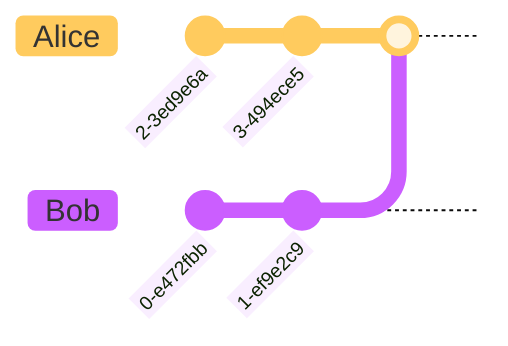

---
theme:
  override:
    default:
      colors:
        background: "1b1235"
    code:
      theme_name: Nord
    mermaid:
      background: "#1b1235"
      scale: 2

---

# Kusama JAM and Kunekt's Private Apps

Let's explore the path towards **unstoppable private real-time JAM applications**

<!-- column_layout: [4, 1, 3] -->
<!-- column: 0 -->
1. **The background** - Virto
2. **The opportunity** - Kusama JAM
3. **The protocol** - Kunekt
4. **The engine** - VOS
5. **The framework** - Writ
6. **The strategy** - Progressive decentralization

<!-- column: 2 -->


<!-- end_slide -->

About Me
========

**Daniel (@olanod)**

<!-- column_layout: [3, 1, 5] -->
<!-- column: 0 -->


<!-- column: 2 -->

Passionate about:
- 🐦 **Kusama**
- 🔓 **Open Source**
- 🔒 **Privacy** 
- 🌐 **Decentralization**
- 🦀 **Rust**

<!-- end_slide -->

About Virto
===========

<!-- column_layout: [3, 1, 7] -->
<!-- column: 0 -->


<!-- column: 2 -->
We on-board start-ups building real-world products to Web3 **like it's Web2**

## A **"Web3 CTO as a Service"**.

> Have a toolkit with *almost** everything you need to power your business

<!-- end_slide -->

Kusama JAM
==========

<!-- column_layout: [5, 1, 5] -->
<!-- column: 0 -->

Decentralized, Private, Kreative,

# **Fast**, Light and Independent

In **Ref#573** KSM holders voted for
- 1sec block production
- 32 cores

*... So many possibilities! 🤤*

<!-- column: 2 -->


<!-- end_slide -->

The protocol: **Kunekt**
======

## Private real-time collaboration on JAM

<!-- column_layout: [5, 1, 5] -->
<!-- column: 0 -->

Because organizations also need:
- **Communications**
- **Collaboration**
- **Encrypted data**
- and **The best UX**

```mermaid +render
block
columns 2
  core1["🧮 JAM Core"]
  core2["🧮 JAM Core"]
  space
  space
  user("👤📱📲👤")
  para("🟩 Kreivo")

  user --> core1
  para --> core2
  core1 <--> core2
```

<!-- column: 2 -->


<!-- end_slide -->

Kunekt Overview
===============

- Smart documents(CRDT) updated P2P
- Peers sync with JAM encrypted history

<!-- column_layout: [1, 1] -->
<!-- column: 0 -->
### Like Git
Merkle-CRDTs


<!-- column: 1 -->
### Like Matrix
Megolm group ratchet


<!-- end_slide -->

The Engine: VOS
===============

# Virtual(Virto) Operating System

<!-- column_layout: [1, 1] -->
<!-- column: 0 -->

- ⚙️ Embedded async runtime (Embassy)
  - Cooperative multitasking
- 🖥️ WASM+WASI
  - AOT RISC-V compilation
  - Capability based VM
- 📜 Shell Scripting

<!-- column: 1 -->

- 🚀 Runs Everywhere
  - **JAM**
  - Web
  - Bare metal
  - Linux
- 🤖Common Abstractions
  - Filesystem
  - Database
  - IPC

<!-- end_slide -->

VOS - A universal backend
====

### For JAM Services
### For Mobile/Web 
### For Web Backends

<!-- end_slide -->

Writ
====

# WASI Real-Time Interoperable Tasks
<!-- column_layout: [2, 3] -->
<!-- column: 0 -->

- Familiar (ink! inspired)
- WASM + WASI
- Great DevX
  - Fast compilation
  - Existing tooling
- Runs everywhere
- RISC-V and PVM friendly(WIP)
- Storage/transport agnostic
- Async

<!-- column: 1 -->
```rust
#[writ::task]
pub mod flipper {
  #[writ(storage)]
  pub struct Flipper {
    value: bool,
  }
  impl Flipper {
    #[writ(constructor)]
    pub fn new(init_value: bool) -> Self {
      Self { value: init_value }
    }
    #[writ(message)]
    pub fn flip(&mut self) {
      self.value = !self.value;
    }
  }
}
```
<!-- end_slide -->

Progressive Decentralization
============================

## a.k.a. **Let's be sneaky**

<!-- column_layout: [1, 1] -->
<!-- column: 0 -->
### For Developers
Let's give them a tool they can use today on their current projects.
> ⚠️ Many(Most?) developers *hate* Blockchain

<!-- column: 1 -->
### For Organizations
Let's provide familiar APIs easy to integrate in existing infra.

> Why hire specialized talent(e.g. Solidity devs)

<!-- reset_layout -->

*... And tomorrow we'll show them how easy it is to join the dark side 😈*
 
<!-- end_slide -->

Demo time!
==========

<!-- end_slide -->


GRACIAS!
========

## Get in touch

<!-- column_layout: [1, 1] -->
<!-- column: 0 -->

Connect:

🗪  **`#kreivo:virto.community`**

📧 daniel@virto.team  
💬 @olanod:virto.community  

<!-- column: 1 -->


