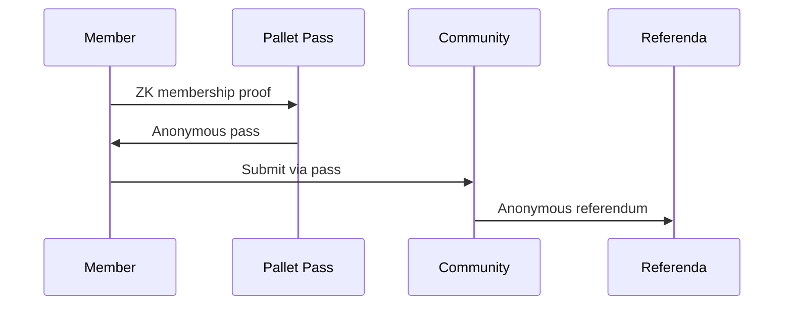
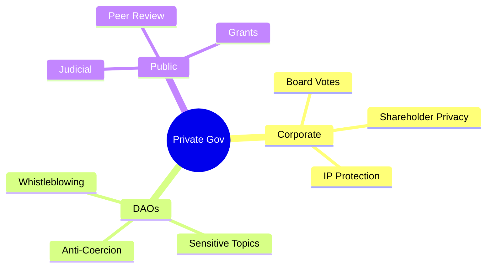

---
theme:
  override:
    default:
      colors:
        background: "1b1235"
    mermaid:
      background: "#1b1235"

---

# Applied ZK in Kusama

## Hacking OpenGov for privacy 

Let's explore ZK applied to our favorite Kusama feature, **governance!**

<!-- column_layout: [1, 5, 1] -->
<!-- column: 1 -->


<!-- end_slide -->

About Me
========

**Founder of Virto**

<!-- column_layout: [3, 1, 5] -->
<!-- column: 0 -->


<!-- column: 2 -->

Passionate about:
- 🐦 **Kusama**
- 🔓 **Open Source**
- 🔒 **Privacy** 
- 🌐 **Decentralization**
- 🦀 **Rust**

<!-- end_slide -->

About Virto
===========


> **"Web3 CTO as a Service"**

We are the tech ally of founders who want to get into Web3 but don't know how.

**Our focus:** Kusama as a simple to integrate Web2-like backend
with all the tools founders need for their project to succeed.

<!-- end_slide -->

The Problem
===========

<!-- column_layout: [5, 1, 5] -->
<!-- column: 0 -->

### Real organizations need privacy

**Current OpenGov:**
- All votes are public and traceable
- Membership is always visible
- Voters can be coerced

<!-- column: 2 -->


<!-- end_slide -->

OpenGov Quick Overview
=====================

## Understanding the foundation

```mermaid +render
flowchart TD
    B[Tracks & Origins] --> A[Pallet Referenda]
    C(Votes) --> A
    E[Conviction Voting] --> C
    F[Collective] --> C
    G[Communities] --> C
    
    style A fill:#071914
    style G fill:#9999ff
```

<!-- column_layout: [5, 1, 5] -->
<!-- column: 0 -->


<!-- column: 2 -->
**Key components:**
- **Referenda**: Manages polls and lifecycle
- **Tracks**: Different governance paths
- **Voting Pallets**: Implement who votes, on what, with what weight

<!-- end_slide -->

Communities Pallet
==================

## Our gateway to privacy

<!-- column_layout: [1, 1] -->
<!-- column: 0 -->

**Current state:**
- Permissionless creation of DAOs
- NFT-based membership
- Public voting
- Open vote counting

<!-- column: 1 -->
**Perfect for privacy because:**
- Flexible membership model
- Extensible voting mechanics

<!-- end_slide -->

Privacy Levels
==============

## Different needs, different solutions

| Level | Membership | Vote | Count | Use Case |
|-------|------------|------|-------|----------|
| **0** | Public | Public | Public | Current OpenGov |
| **1** | Public | Private | Public | Board decisions |
| **2** | Private | Public | Public | Voter protection |
| **3** | Private | Private | Encrypted | Maximum privacy |

```mermaid +render
graph LR
    A[Level 0] --> B[Level 1]
    B --> C[Level 2]
    C --> D[Level 3]
    
    style A fill:#071914
    style B fill:#172924
    style C fill:#aa99ff
    style D fill:#9999ff
```



<!-- end_slide -->

Level 1: Anonymous Voting
=========================

## Public membership, private votes

<!-- column_layout: [1, 1] -->
<!-- column: 0 -->

**How it works:**
1. Member generates ZK proof of membership
2. Submits vote with proof
3. Public counting proceeds

<!-- column: 1 -->

**Circuit proves:**
"I am a member and cast this vote"


<!-- end_slide -->

Level 2: Hidden Membership
==========================

## Private membership, open counting

<!-- column_layout: [1, 1] -->
<!-- column: 0 -->

**Key innovation:**
- ZK-friendly merkle tree of DAO members kept off-chain 
- Member can proof she can vote with the given conviction

<!-- column: 1 -->
**Circuit proves:**
"Voting happed off-chain, here's the vote"

<!-- end_slide -->

Level 3: Encrypted Counting
===========================

## Maximum privacy with homomorphic encryption

<!-- column_layout: [1, 1] -->
<!-- column: 0 -->

**Homomorphic counting:**
- Votes encrypted with HE scheme
- Tallying on encrypted values
- Decrypt only final result

<!-- column: 1 -->

**Perfect combination:**
- ZK: Proves valid encrypted vote
- HE: Enables private counting

<!-- end_slide -->

Anonymous Proposals
==================

## Using pallet-pass for ZK dispatching

<!-- column_layout: [1, 1] -->
<!-- column: 0 -->

**Process:**
1. Generate ZK membership proof
2. Validate transaction comes from a DAO member
3. Submit referendum from community origin
4. Proposal appears without attribution

<!-- column: 1 -->



<!-- end_slide -->

Virto's Developer Tools
======================

## Making ZK accessible

<!-- column_layout: [1, 1] -->
<!-- column: 0 -->

**The challenge:**
- Circuit development is complex
- Unfamiliar syntax for Substrate devs
- High learning curve

**Our solution:**
- ink!-like DSL for circuits
- Familiar contract syntax
- Seamless pallet integration

<!-- column: 1 -->

```rust
#[zink::circuit]
mod membership_proof {
    #[message]
    fn verify_member(
        &self,
        #[private] member_id: Field,
        #[private] path: [Field; 8],
    ) -> bool {
        merkle_verify(
            member_id, 
            path, 
            self.merkle_root
        )
    }
}
```

<!-- end_slide -->

Implementation Roadmap
=====================

## From concept to reality

<!-- column_layout: [1, 1] -->
<!-- column: 0 -->

**Phase 0: Developer Tools**
- ink!-like DSL
- Integration tooling

**Phase 1: Foundation**
- Extend communities pallet
- Basic ZK membership proofs
- Anonymous proposals

<!-- column: 1 -->

**Phase 2: Private Voting**
- Vote commitments & reveals
- Level 1 privacy

**Phase 3: Advanced Privacy**
- Homomorphic encryption
- Levels 2 & 3 privacy


<!-- end_slide -->

Real-World Applications
======================

## Who needs private governance?

<!-- column_layout: [1, 1] -->
<!-- column: 0 -->

**Corporate Governance:**
- Board vote confidentiality
- Shareholder privacy
- IP protection

**DAOs & Communities:**
- Anonymous whistleblowing
- Sensitive discussions
- Anti-coercion protection

**Public Institutions:**
- Judicial decisions
- Academic peer review
- Grant allocations

<!-- column: 1 -->



<!-- end_slide -->

Let's Brainstorm Together!
=========================

## How can we make Kusama governance private?

<!-- column_layout: [1, 1] -->
<!-- column: 0 -->

**Discussion topics:**
- What privacy features matter most?
- Which use cases should we prioritize?
- How do we balance privacy with transparency?
- What developer tools would help adoption?

<!-- column: 1 -->
**Your ideas are welcome:**
- Novel privacy mechanisms
- Integration approaches
- User experience improvements
- Governance model innovations

<!-- reset_layout -->
**Let's hack governance together!**

<!-- column_layout: [1, 1] -->
<!-- column: 0 -->

Connect:

📧 daniel@virto.team  
💬 @olanod:virto.community  

<!-- column: 1 -->

